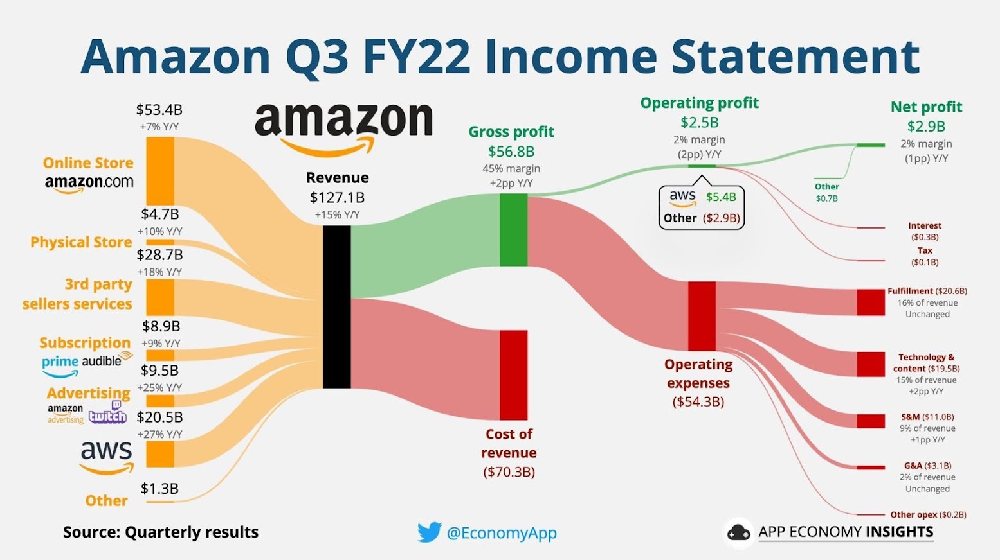
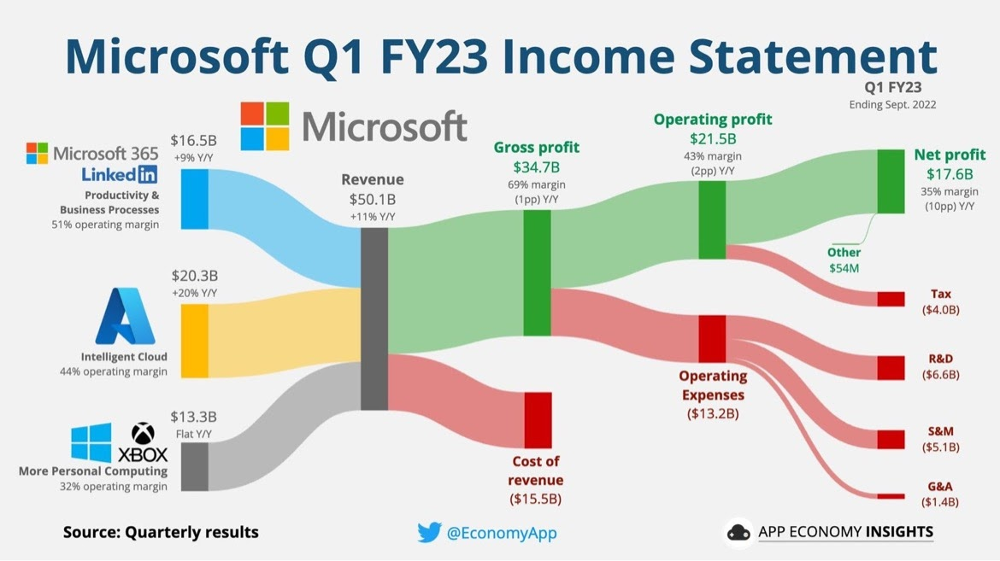
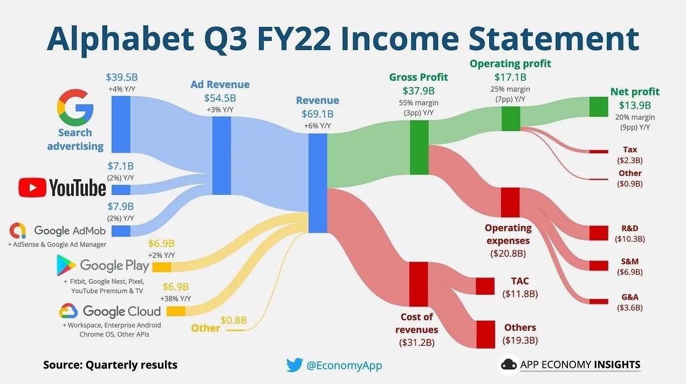
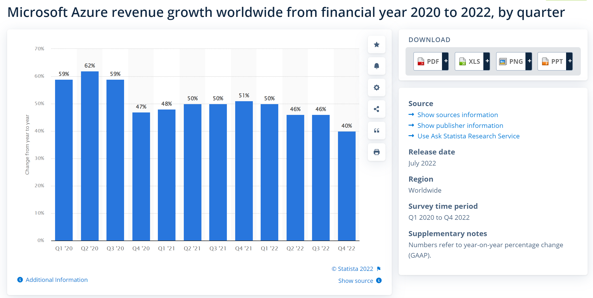

# About Me (陳碩璜)
- Academia Sinica (R&D Substitute Service)
- TSMC (Senior Software Engineer)
- Microsoft (Software Engineer, current)

# Major Topics I want to share
- Clouds Technology (Microsfot Azure as an example)
    - Introduction
    - Demo of Cloud Service Development
    - Some material to learn Azure
- Experience in my career
# Clouds Technology
- **Clouds Market**

- **Why Clouds?**
    - High Availability
    - Scalability
    - Reliability (Recover from failures)
    - Performance Predictability (Autoscaling, Load balancing)
    - Cost Predictability
    - Security
    - Governance (Corporate standard, government requirment)
    - Manageability
        - Interface (web portal, APIs, Powershell, command lines)
        - Monitoring
    - Responsibility Sharing
    
- **IaaS,PaaS,SaaS** 
    - [*Reference](https://medium.com/chenjd-xyz/azure-fundamental-iaas-paas-saas-973e0c406de7)

- **[Key Azure services for developers](https://learn.microsoft.com/en-us/azure/developer/intro/azure-developer-key-services)**
- **Material for leaning Azure**
    - [Register an Azure account for trial](https://azure.microsoft.com/zh-tw/free/)
    - [Microsoft Learn- Azure Document](https://learn.microsoft.com/zh-tw/azure/?product=popular)
    - [Exam AZ-900: Microsoft Azure Fundamentals](https://learn.microsoft.com/en-us/certifications/exams/az-900)
    - [Infrastructure As Code](https://learn.microsoft.com/en-us/devops/deliver/what-is-infrastructure-as-code)
    - [A handy new Google Cloud, AWS, and Azure product map](https://cloud.google.com/blog/topics/developers-practitioners/handy-new-google-cloud-aws-and-azure-product-map?utm_source=linkedin&utm_medium=unpaidsoc&utm_campaign=fy22q3-googlecloud-blog-ease_of_use-in_feed-no-brand-global&utm_content=july-boost&utm_term=-)
    - [Azure Architectures](https://learn.microsoft.com/en-us/azure/architecture/)
    - [Case sharing-Pushing the boundaries of renewable energy production efficiency with Azure Digital Twins](https://customers.microsoft.com/en-us/story/848311-doosan-manufacturing-azure-digital-twins)
    - [Case sharing-Creating the brewery of the future with Anheuser-Busch InBev](https://youtu.be/POtqYy_t-eY)
    - [Inside Azure for IT](https://azure.microsoft.com/en-us/resources/it/#fireside-chats)
# Experience in my career
- Microsoft VS. TSMC
    - Software industry VS. Semiconductor mnufacturing industry
    - Values
        - **Microsoft**: to empower every person and every organization on the planet to achieve more; Diversity and Inclusion
        - **TSMC**: Commitment, Innovation, Customer trust**
    - Requirements for employees
        - **Microsoft**: techniques, leaning capability, growing mindset, collaboration, Inclusion
        - **TSMC**: commitment, social skill, performance
- What are important for an software engineer
    - techniques
    - learning capability
    - code understanding
    - implementation
    - troubleshooting skill
    - communication skill
    - care about new techniques and applications
    - [High Level] Insight about new techniques and technology market
